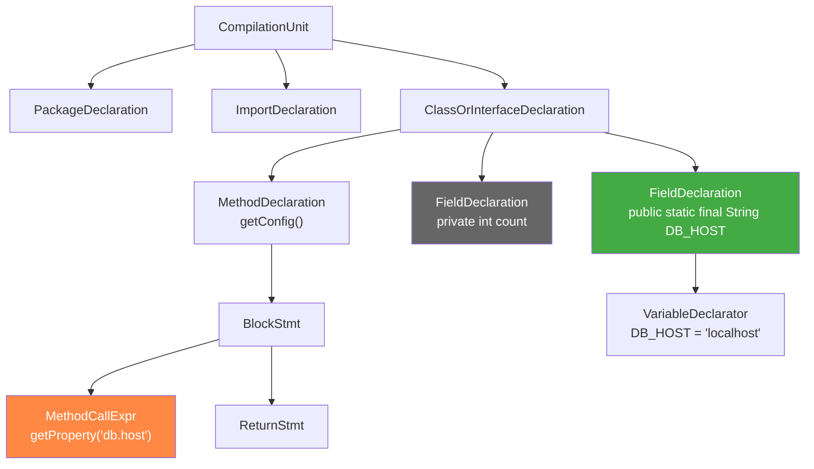
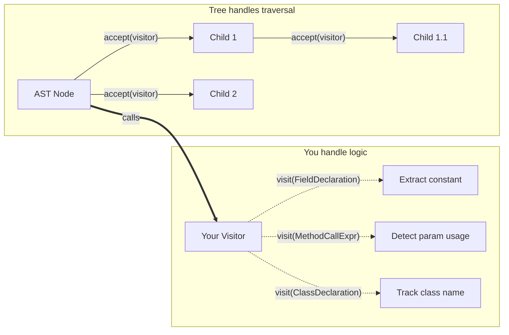
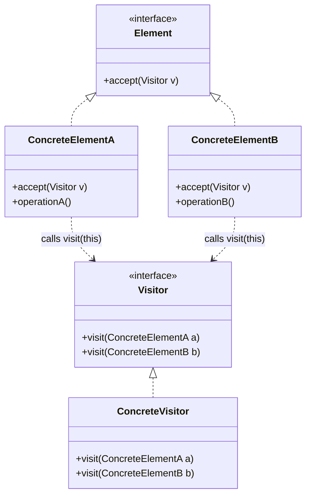
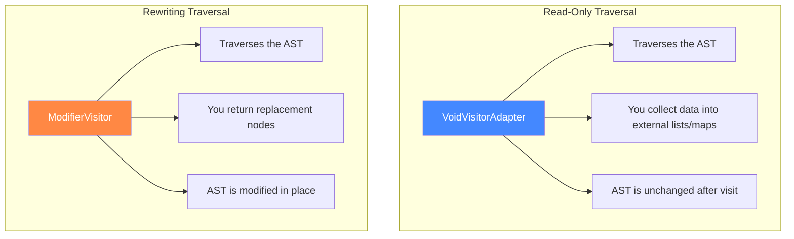
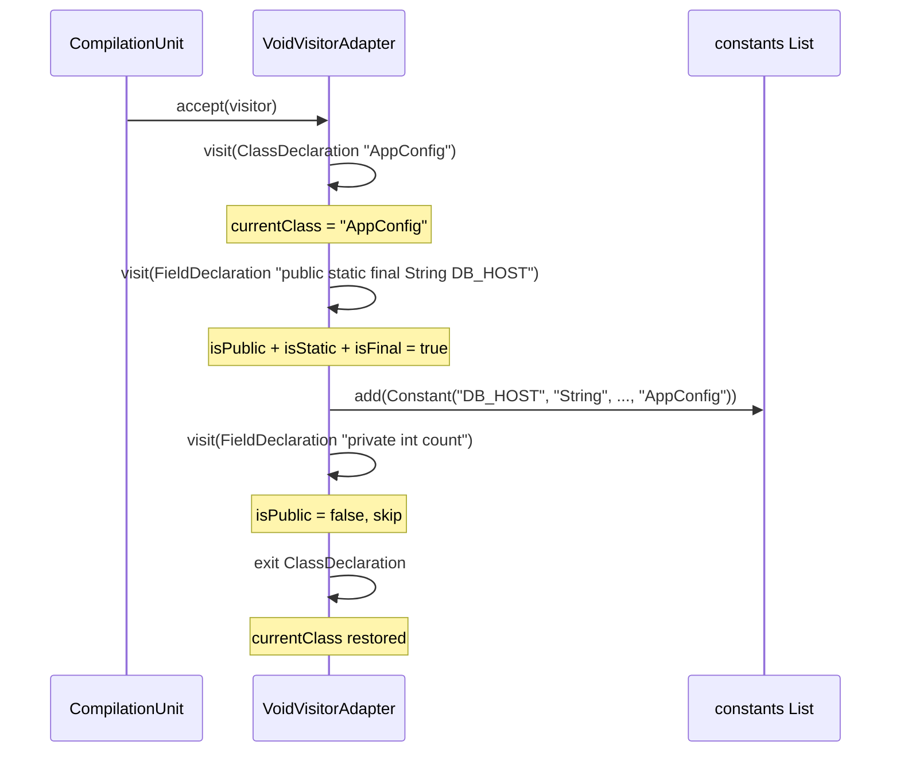
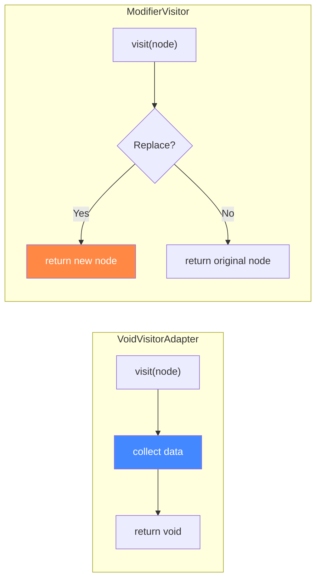
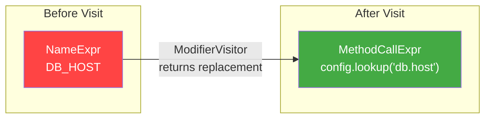
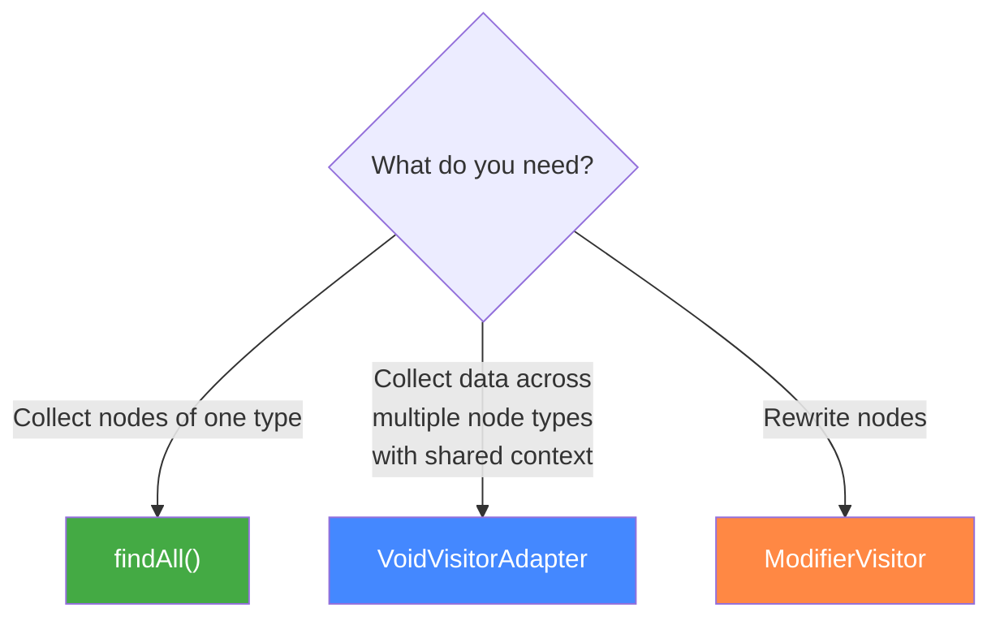
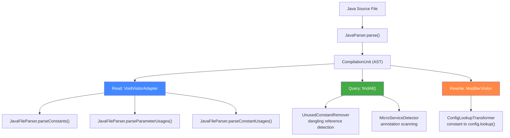

# Visiting Constants: The Visitor Pattern in Action

How the Constants Catalog uses the Visitor pattern to walk, read, and rewrite Java source code — and why it's the right tool for AST traversal.

---

## Table of Contents

1. [The Problem: Walking a Tree Without Modifying It](#1-the-problem-walking-a-tree-without-modifying-it)
2. [The Visitor Pattern](#2-the-visitor-pattern)
3. [The Gang of Four Blueprint](#3-the-gang-of-four-blueprint)
4. [JavaParser's Two Visitors](#4-javaparsers-two-visitors)
5. [How We Read: VoidVisitorAdapter in JavaFileParser](#5-how-we-read-voidvisitoradapter-in-javafileparser)
6. [How We Transform: ModifierVisitor in ConfigLookupTransformer](#6-how-we-transform-modifiervisitor-in-configlookuptransformer)
7. [The Shortcut: findAll()](#7-the-shortcut-findall)
8. [Three Approaches Compared](#8-three-approaches-compared)
9. [Why Not Just Use for Loops?](#9-why-not-just-use-for-loops)
10. [Patterns and Pitfalls](#10-patterns-and-pitfalls)

---

## 1. The Problem: Walking a Tree Without Modifying It

When we scan a Java file, we need to find all `public static final` fields, detect `@Value` annotations, track constant usages across classes, and identify microservice annotations. The parsed source code is a tree — an Abstract Syntax Tree (AST):



We need to visit specific node types (green: constants to catalog, orange: parameter usages to track) while skipping others (grey: private fields we ignore). The tree can be arbitrarily deep — inner classes, anonymous classes, lambdas, nested method calls.

We could write recursive traversal code ourselves. But every new feature would mean another recursive walker with the same boilerplate. The Visitor pattern solves this.

---

## 2. The Visitor Pattern

The Visitor pattern separates **what you do at each node** from **how you traverse the tree**. The tree structure handles traversal; you just say what happens when you arrive at each node type.



The key insight: **you override only the `visit()` methods for node types you care about**. All other node types are traversed automatically by the base class's default implementation, which just recurses into children.

---

## 3. The Gang of Four Blueprint

The original pattern from *Design Patterns* (1994) has two roles:



**Element** (AST node): Knows its children, accepts a visitor, and calls `visitor.visit(this)`.

**Visitor** (your code): Has a `visit()` method for each element type. You implement the ones you care about.

The "double dispatch" trick: `element.accept(visitor)` calls `visitor.visit(element)`. The element's concrete type determines which `visit()` overload runs. This replaces `instanceof` chains with polymorphism.

---

## 4. JavaParser's Two Visitors

JavaParser provides two visitor base classes. Each serves a different purpose:



| Visitor | Return Type | Effect | Used In |
|---|---|---|---|
| `VoidVisitorAdapter<A>` | `void` | Read-only — collects data | `JavaFileParser` (scanning) |
| `ModifierVisitor<A>` | `Visitable` | Read-write — returns replacement nodes | `ConfigLookupTransformer` (rewriting) |

Both handle traversal automatically. You override specific `visit()` methods. The difference is whether you're **reading** the tree or **rewriting** it.

---

## 5. How We Read: VoidVisitorAdapter in JavaFileParser

`JavaFileParser` uses `VoidVisitorAdapter` in three places, each extracting different data from the same kind of tree. Here's how the constant extraction works:

### The Code (simplified from `parseConstants()`)

```java
compilationUnit.accept(new VoidVisitorAdapter<Void>() {
    private String currentClass = "";

    @Override
    public void visit(ClassOrInterfaceDeclaration n, Void arg) {
        String previousClass = currentClass;
        currentClass = n.getNameAsString();
        super.visit(n, arg);          // ← recurse into children
        currentClass = previousClass;  // ← restore on exit
    }

    @Override
    public void visit(FieldDeclaration field, Void arg) {
        if (isPublic && isStatic && isFinal) {
            constants.add(new Constant(name, type, value, fileName, currentClass, ...));
        }
        super.visit(field, arg);      // ← recurse into children
    }
}, null);
```

### What's Happening



### Key Techniques

**1. Tracking context with a stack variable:**

The `currentClass` field acts as a manual stack. When entering a class, save the previous value and set the new one. When exiting (after `super.visit()`), restore the previous value. This handles inner classes correctly:

```java
class Outer {                    // currentClass = "Outer"
    class Inner {                // currentClass = "Inner"
        static final int X = 1; // recorded as Inner.X
    }                            // currentClass = "Outer" (restored)
    static final int Y = 2;     // recorded as Outer.Y
}
```

**2. Always calling `super.visit()`:**

This is critical. `super.visit(n, arg)` continues the traversal into child nodes. If you forget it, the visitor stops at that node and never sees its children. Every `visit()` override must call `super.visit()` unless you intentionally want to prune the traversal.

**3. Collecting into an external list:**

`VoidVisitorAdapter` returns `void`, so you can't return data. Instead, the visitor writes to a list (`constants`) or map (`javaFileFqns`) declared in the enclosing scope. The anonymous inner class captures these as effectively-final references.

### All Three Visitors in JavaFileParser

| Method | Visits | Collects |
|---|---|---|
| `parseConstants()` | `ClassOrInterfaceDeclaration`, `EnumDeclaration`, `FieldDeclaration` | `public static final` fields into `List<Constant>` |
| `parseParameterUsages()` | `ClassOrInterfaceDeclaration`, `FieldDeclaration` (for `@Value`), `MethodCallExpr` (for `getProperty()`) | Property lookups into `List<ParameterUsage>` |
| `parseConstantUsages()` | `ClassOrInterfaceDeclaration`, `FieldAccessExpr` (for `AppConfig.DB_HOST`), `NameExpr` (for bare `DB_HOST` via static import) | Cross-class references into `List<ConstantUsage>` |

Each visitor walks the same tree structure but looks for different things. The Visitor pattern lets us reuse the traversal machinery and focus on what to extract.

---

## 6. How We Transform: ModifierVisitor in ConfigLookupTransformer

When we replace constants with `config.lookup()` calls, we need to **change** the AST, not just read it. That's where `ModifierVisitor` comes in.

### The Code (simplified from `transformFile()`)

```java
cu.accept(new ModifierVisitor<Void>() {
    @Override
    public Visitable visit(NameExpr n, Void arg) {
        ConstantTarget target = constantTargets.get(n.getNameAsString());
        if (target != null && !isDeclaration(n)) {
            return createConfigLookupCall(target);  // ← return REPLACEMENT node
        }
        return super.visit(n, arg);                 // ← keep original
    }

    @Override
    public Visitable visit(FieldAccessExpr n, Void arg) {
        ConstantTarget target = constantTargets.get(n.getNameAsString());
        if (target != null) {
            return createConfigLookupCall(target);  // ← return REPLACEMENT node
        }
        return super.visit(n, arg);                 // ← keep original
    }

    @Override
    public Visitable visit(MethodCallExpr n, Void arg) {
        super.visit(n, arg);  // ← recurse first so children are transformed
        if (isPropertyGetter(n)) {
            return createParameterLookupCall(target, methodName);
        }
        return n;             // ← keep original
    }
}, null);
```

### The Difference from VoidVisitorAdapter



With `ModifierVisitor`, each `visit()` method returns a `Visitable`. If you return a **different** node, the AST is rewritten in place. If you return `super.visit(n, arg)` or the original node, nothing changes.

### Before and After



The constant reference `DB_HOST` is replaced by a `config.lookup("db.host")` call — without manually walking the tree or tracking parent nodes. The visitor handles the plumbing.

### Why `super.visit()` First in MethodCallExpr

Notice that `visit(MethodCallExpr)` calls `super.visit(n, arg)` **before** checking if it's a property getter. This ensures child nodes are transformed first. If a method argument contains a constant reference, it gets replaced before we inspect the method call itself. Order matters in a rewriting visitor.

---

## 7. The Shortcut: findAll()

JavaParser also provides `findAll()`, which is a visitor under the hood but with a simpler API:

```java
// UnusedConstantRemover uses this extensively
List<FieldDeclaration> fields = compilationUnit.findAll(FieldDeclaration.class);

// Dangling reference detection
cu.findAll(NameExpr.class).forEach(nameExpr -> {
    referencedNames.add(nameExpr.getNameAsString());
});

cu.findAll(FieldAccessExpr.class).forEach(fieldAccess -> {
    referencedNames.add(fieldAccess.getNameAsString());
});
```

And `MicroServiceDetector` uses it too:

```java
List<ClassOrInterfaceDeclaration> classes = cu.findAll(ClassOrInterfaceDeclaration.class);
```

### When to Use Each



| Approach | Best For | Example |
|---|---|---|
| `findAll(Type.class)` | Grab all nodes of one type, no context needed | Find all `FieldDeclaration` nodes for removal |
| `VoidVisitorAdapter` | Walk multiple node types, track context (current class, scope) | Extract constants with class names |
| `ModifierVisitor` | Replace or remove nodes during traversal | Replace `DB_HOST` with `config.lookup("db.host")` |

`findAll()` is simpler but limited — you can't track which class you're inside, and you can't correlate across node types in a single pass. When you need context, use a visitor.

---

## 8. Three Approaches Compared

Here's how the same task — "find all public static final String fields" — looks with each approach:

### findAll() + filter

```java
cu.findAll(FieldDeclaration.class).stream()
    .filter(f -> f.isPublic() && f.isStatic() && f.isFinal())
    .forEach(f -> { /* no class context available */ });
```

Simple, but you don't know which class each field belongs to.

### VoidVisitorAdapter

```java
cu.accept(new VoidVisitorAdapter<Void>() {
    private String currentClass = "";

    @Override
    public void visit(ClassOrInterfaceDeclaration n, Void arg) {
        currentClass = n.getNameAsString();
        super.visit(n, arg);
    }

    @Override
    public void visit(FieldDeclaration field, Void arg) {
        if (isPublic && isStatic && isFinal) {
            // currentClass is available here
            results.add(new Constant(..., currentClass, ...));
        }
        super.visit(field, arg);
    }
}, null);
```

More code, but you have full context.

### ModifierVisitor (if you wanted to remove them)

```java
cu.accept(new ModifierVisitor<Void>() {
    @Override
    public Visitable visit(FieldDeclaration field, Void arg) {
        if (isPublic && isStatic && isFinal) {
            return null;  // returning null removes the node
        }
        return super.visit(field, arg);
    }
}, null);
```

Same traversal, but the return value rewrites the tree.

---

## 9. Why Not Just Use for Loops?

You could manually recurse through the AST:

```java
for (TypeDeclaration<?> type : cu.getTypes()) {
    if (type instanceof ClassOrInterfaceDeclaration cls) {
        for (BodyDeclaration<?> member : cls.getMembers()) {
            if (member instanceof FieldDeclaration field) {
                // check modifiers, extract constant...
            }
            if (member instanceof ClassOrInterfaceDeclaration inner) {
                // recurse manually... again
                for (BodyDeclaration<?> innerMember : inner.getMembers()) {
                    // and again for every nesting level...
                }
            }
        }
    }
}
```

Problems with this:

1. **Depth is unbounded** — inner classes, anonymous classes, and local classes nest arbitrarily deep. Manual recursion means writing the same traversal loop at every level.
2. **Easy to miss node types** — `EnumDeclaration`, `RecordDeclaration`, anonymous classes in initializers... the manual approach must enumerate every container type.
3. **Duplicated traversal** — every feature (constant extraction, parameter detection, usage tracking) needs its own copy of the traversal code.

The Visitor pattern handles all of this. `super.visit()` recurses to any depth, across all node types, automatically. You just say what to do when you find what you're looking for.

---

## 10. Patterns and Pitfalls

### Pattern: The Context Stack

Track where you are in the tree using a variable that saves and restores:

```java
@Override
public void visit(ClassOrInterfaceDeclaration n, Void arg) {
    String previous = currentClass;     // save
    currentClass = n.getNameAsString();
    super.visit(n, arg);                // recurse (may visit inner classes)
    currentClass = previous;            // restore
}
```

This is used in every visitor in `JavaFileParser`. Without the save/restore, inner class fields would be attributed to the wrong class.

### Pitfall: Forgetting super.visit()

```java
@Override
public void visit(ClassOrInterfaceDeclaration n, Void arg) {
    currentClass = n.getNameAsString();
    // OOPS — no super.visit(n, arg)!
}
```

The visitor will never see any fields, methods, or inner classes inside this class. The traversal stops here. Always call `super.visit()` unless you intentionally want to skip a subtree.

### Pitfall: Modifying a Collection During Traversal

```java
// DON'T do this
@Override
public Visitable visit(FieldDeclaration field, Void arg) {
    field.remove();  // modifies the AST while traversing it
    return super.visit(field, arg);
}
```

Removing nodes while the visitor is mid-traversal can cause `ConcurrentModificationException` or skip nodes. With `ModifierVisitor`, return `null` to remove a node — the visitor handles it safely after traversal.

### Pattern: Visitor for Detection, findAll for Batch Operations

In this project, the pattern is:

- **Detection and extraction** (need context): Use `VoidVisitorAdapter` — e.g., `JavaFileParser` extracting constants with class names
- **Batch retrieval** (no context needed): Use `findAll()` — e.g., `UnusedConstantRemover` getting all `FieldDeclaration` nodes to check removal candidates
- **Rewriting**: Use `ModifierVisitor` — e.g., `ConfigLookupTransformer` replacing constant references with config lookups

### Pattern: Anonymous Inner Classes as Visitors

Every visitor in this project is an anonymous inner class:

```java
cu.accept(new VoidVisitorAdapter<Void>() {
    // visitor logic here
}, null);
```

This keeps the visitor close to where it's used. Since each visitor is specific to one extraction task (constants, parameter usages, constant usages), there's no benefit to making them named top-level classes. If the same visitor logic were needed in multiple places, extracting it to a named class would be the right call.

### Summary



The Visitor pattern is the backbone of how this project interacts with Java source code. Every scan, every transformation, and every removal flows through one of these three visitor mechanisms. The pattern keeps traversal logic out of business logic, making it straightforward to add new analysis passes — like microservice detection — without touching the traversal machinery.
