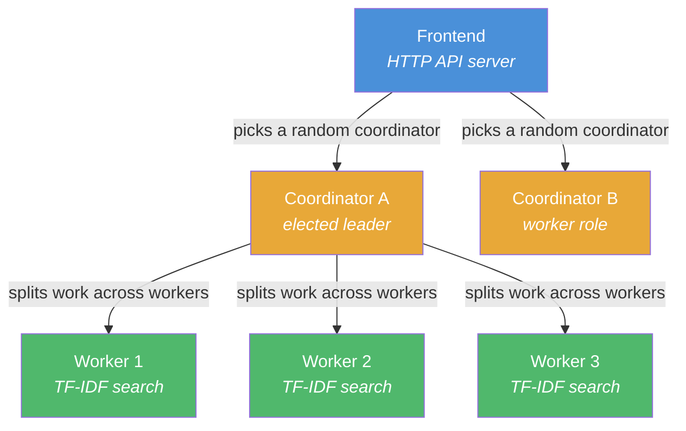
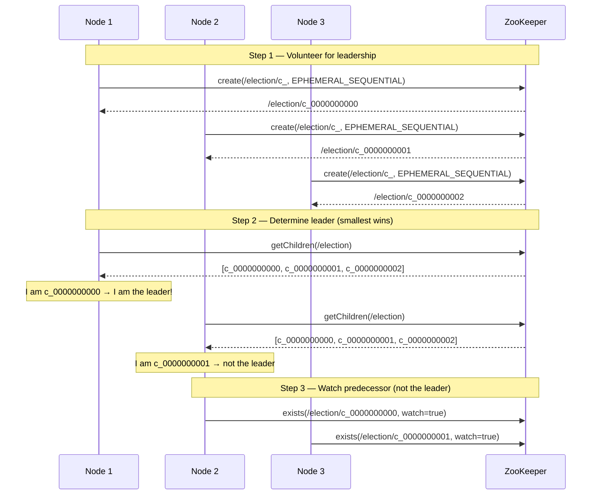
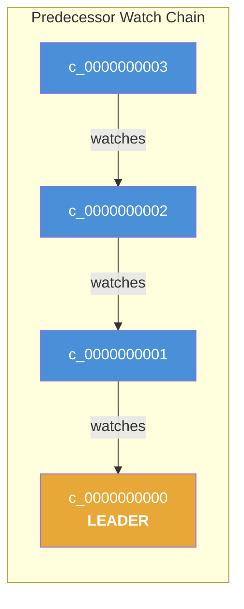
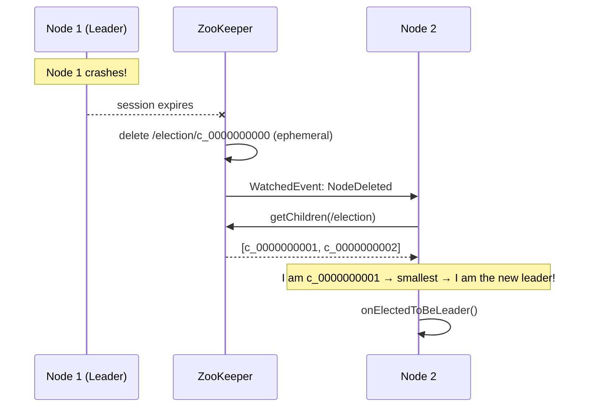
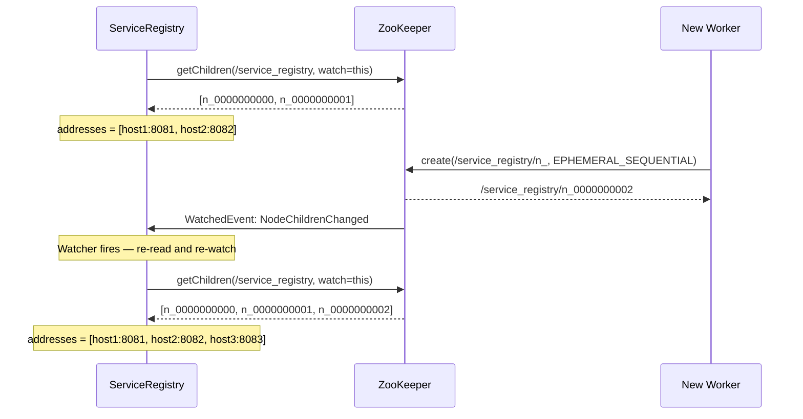
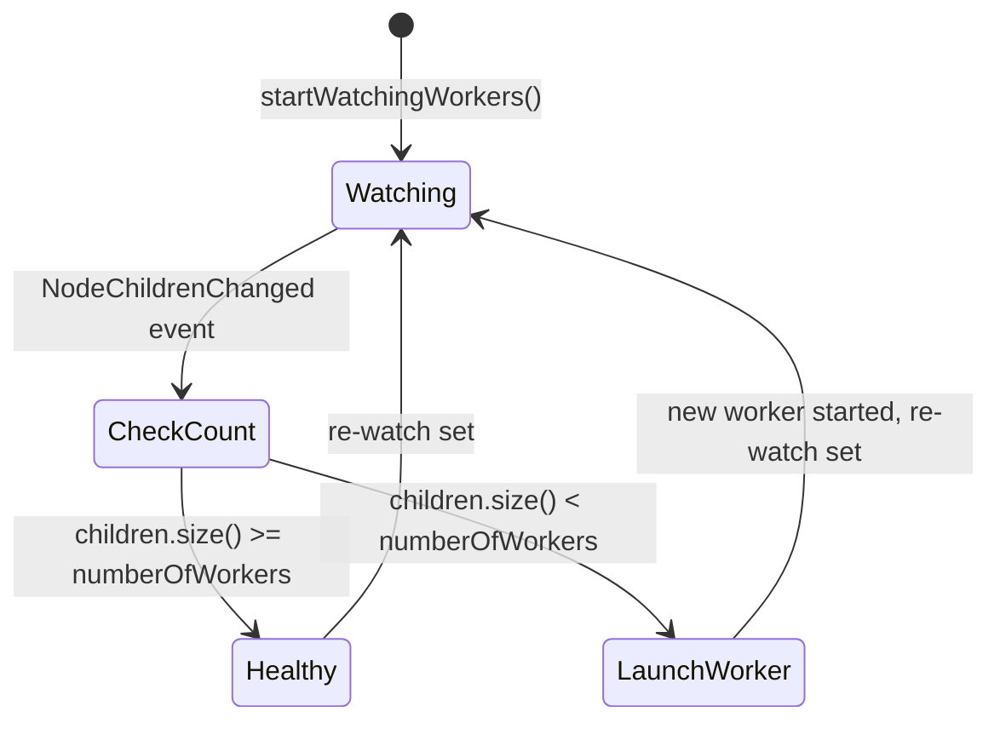
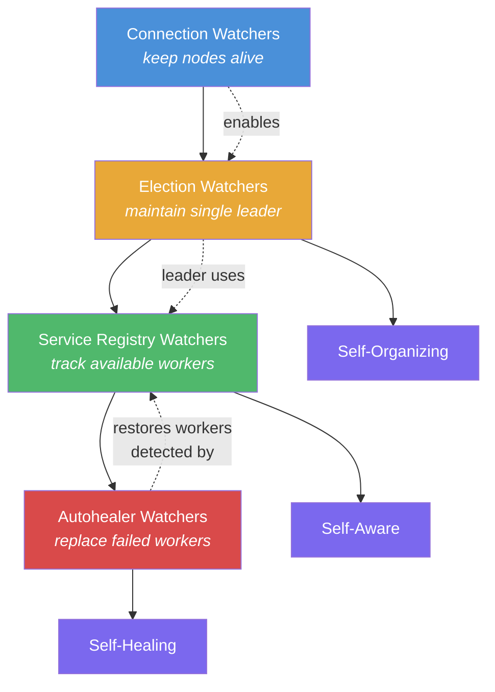

# Distributed Systems & Cloud Computing with Java

## Project Overview

This project is an educational implementation of core distributed systems concepts using **Apache ZooKeeper** as the coordination service. It demonstrates leader election, service discovery, distributed search, and self-healing infrastructure through a collection of interconnected Java modules.

The project is authored by Michael Pogrebinsky and licensed under the MIT License.

## Module Structure

The project is organized into seven sub-modules, each built with Maven and targeting Java 21:

| Module | Purpose |
|--------|---------|
| `leader-reelection` | Standalone leader election using ZooKeeper sequential ephemeral znodes |
| `service-registry` | Leader election combined with service registration and discovery |
| `distributed-search-worker-node` | Worker nodes that perform TF-IDF search computations |
| `distributed-search-cluster-node` | Coordinator nodes that distribute work across workers and aggregate results |
| `distributed-search-frontend` | HTTP frontend that accepts user search queries and routes them to coordinators |
| `autohealer` | Manager process that monitors worker health and auto-restarts failed workers |
| `autohealer/flakyworker` | Simulated unreliable worker that crashes randomly, used to exercise the autohealer |

All modules depend on Apache ZooKeeper (versions 3.4.12 through 3.9.3) for distributed coordination.

---

## Distributed Search Architecture

The most complex subsystem is a **three-tier distributed search engine**:



1. **Workers** perform TF-IDF (Term Frequency-Inverse Document Frequency) calculations on assigned document subsets and register their addresses in the service registry.
2. **Coordinators** are elected via leader election. The elected leader coordinates search across all registered workers, splits the document corpus among them, sends HTTP requests in parallel, and aggregates ranked results.
3. **Frontend** exposes an HTTP endpoint, picks a random coordinator from the coordinators service registry, forwards the search query, and returns the aggregated results.

---

## Why Elections Are Critical in ZooKeeper

### The Fundamental Problem

In any distributed system where multiple nodes must cooperate, a core question arises: **who is in charge?** Without a single agreed-upon leader, the system faces several dangers:

- **Split-brain**: Two or more nodes believe they are the leader simultaneously, issuing conflicting commands and corrupting shared state.
- **Duplicate work**: Without a coordinator, workers may redundantly process the same tasks, wasting resources.
- **No coordination**: Tasks that require a global view (aggregating search results, rebalancing partitions, deciding who handles which documents) need a single decision-maker.
- **Deadlock and livelock**: Peer-to-peer consensus without a leader is expensive (requiring quorum protocols for every decision) and can stall under contention.

### How Leader Election Works in This Project

The project implements leader election using ZooKeeper's **ephemeral sequential znodes**, a well-known pattern sometimes called the "small-node-wins" algorithm. The implementation lives in `LeaderElection.java` and follows these steps:



#### Step 1: Volunteer for Leadership

Each node that starts up creates an **ephemeral sequential** znode under the `/election` namespace:

```java
String znodePrefix = ELECTION_NAMESPACE + "/c_";
String znodeFullPath = zooKeeper.create(znodePrefix,
        new byte[]{},
        ZooDefs.Ids.OPEN_ACL_UNSAFE,
        CreateMode.EPHEMERAL_SEQUENTIAL);
```

ZooKeeper appends a monotonically increasing 10-digit sequence number to each znode, producing paths like `/election/c_0000000000`, `/election/c_0000000001`, etc.

Because the znodes are **ephemeral**, they are automatically deleted if the node that created them disconnects or its session expires. This is the foundation of self-healing leadership.

#### Step 2: Determine the Leader

All children of `/election` are retrieved and sorted lexicographically. The node whose znode has the **smallest sequence number** becomes the leader:

```java
List<String> children = zooKeeper.getChildren(ELECTION_NAMESPACE, false);
Collections.sort(children);
String smallestChild = children.get(0);

if (smallestChild.equals(currentZnodeName)) {
    onElectionCallback.onElectedToBeLeader();  // This node is the leader
    return;
}
```

#### Step 3: Watch the Predecessor (Not the Leader)

Non-leader nodes do **not** watch the leader's znode directly. Instead, each node watches its **immediate predecessor** in the sorted sequence:

```java
int predecessorIndex = Collections.binarySearch(children, currentZnodeName) - 1;
predecessorZnodeName = children.get(predecessorIndex);
predecessorStat = zooKeeper.exists(ELECTION_NAMESPACE + "/" + predecessorZnodeName, this);
```

This is a critical design choice. If all N nodes watched the leader's znode, then when the leader dies, ZooKeeper would need to deliver N-1 notifications simultaneously (a "herd effect"), and all nodes would simultaneously query `/election` children, creating a thundering herd. By watching only the predecessor, the notification chain is linear: only one node is notified, and leadership transfers in O(1) notifications.



#### Step 4: React to Leader Failure

When a predecessor znode is deleted (the predecessor node crashed or disconnected), the watcher callback fires and the node re-runs the election logic:

```java
@Override
public void process(WatchedEvent event) {
    switch (event.getType()) {
        case NodeDeleted:
            reelectLeader();
    }
}
```

If the deleted predecessor happened to be the leader, the next node in line now holds the smallest sequence number and becomes the new leader. If it was an intermediate node, the watcher simply re-attaches to the new predecessor.



#### Step 5: Role-Based Behavior via Callbacks

The `OnElectionCallback` interface decouples election logic from application behavior:

```java
public interface OnElectionCallback {
    void onElectedToBeLeader();
    void onWorker();
}
```

In the `service-registry` module, the concrete `OnElectionAction` class implements this:

- **`onElectedToBeLeader()`**: The leader **unregisters** itself from the service registry (it no longer acts as a worker) and **subscribes to updates** to track all registered workers.
- **`onWorker()`**: Workers **register** their HTTP address in the service registry so the leader can discover and send work to them.

This means the same binary can play different roles depending on election outcome, enabling homogeneous deployments.

### Why Elections Are Critical — Summarized

| Concern | How Leader Election Solves It |
|---------|------------------------------|
| **Single point of coordination** | Exactly one leader exists at any time to make global decisions |
| **Automatic failover** | Ephemeral znodes auto-delete on disconnect, triggering re-election within milliseconds |
| **No split-brain** | ZooKeeper's linearizable guarantees ensure only one node sees itself as the smallest |
| **Scalable notification** | Predecessor-watching limits notifications to O(1) per failure instead of O(N) |
| **Role differentiation** | Callbacks allow the same application binary to act as leader or worker based on election outcome |

---

## How Watchers Are Used

ZooKeeper Watchers are the reactive event mechanism that makes the entire system responsive to change without polling. A `Watcher` is a one-time callback that fires when a znode is created, deleted, or modified, or when a znode's children change. **Every watcher fires exactly once** — the application must re-register the watcher in the callback handler to continue receiving events.

This project uses watchers in four distinct patterns:

```mermaid
graph TD
    subgraph "Pattern 1: Connection Lifecycle"
        App["Application / Autohealer"]
        ZK1["ZooKeeper Client"]
        App -- "new ZooKeeper(addr, timeout, this)" --> ZK1
        ZK1 -- "SyncConnected / Disconnected" --> App
    end

    subgraph "Pattern 2: Leader Re-election"
        LE["LeaderElection"]
        Pred["Predecessor ZNode"]
        LE -- "exists(predecessor, watch=this)" --> Pred
        Pred -- "NodeDeleted → reelectLeader()" --> LE
    end

    subgraph "Pattern 3: Service Registry"
        SR["ServiceRegistry"]
        Reg["/service_registry children"]
        SR -- "getChildren(registry, watch=this)" --> Reg
        Reg -- "NodeChildrenChanged → updateAddresses()" --> SR
    end

    subgraph "Pattern 4: Auto-healing"
        AH["Autohealer"]
        Workers["/workers children"]
        AH -- "getChildren(/workers, watch=this)" --> Workers
        Workers -- "NodeChildrenChanged → launchWorkersIfNecessary()" --> AH
    end

    style App fill:#4a90d9,color:#fff
    style LE fill:#e8a838,color:#fff
    style SR fill:#50b86c,color:#fff
    style AH fill:#d94a4a,color:#fff
```



### Pattern 1: Connection Lifecycle Monitoring

Every `Application` class and the `Autohealer` implement `Watcher` and pass `this` as the default watcher when creating the ZooKeeper client:

```java
this.zooKeeper = new ZooKeeper(ZOOKEEPER_ADDRESS, SESSION_TIMEOUT, this);
```

The `process()` method handles connection state transitions:

```java
public void process(WatchedEvent event) {
    switch (event.getType()) {
        case None:
            if (event.getState() == Event.KeeperState.SyncConnected) {
                System.out.println("Successfully connected to Zookeeper");
            } else {
                synchronized (zooKeeper) {
                    System.out.println("Disconnected from Zookeeper event");
                    zooKeeper.notifyAll();  // Unblock the main thread to allow shutdown
                }
            }
    }
}
```

The main thread blocks on `zooKeeper.wait()` until this watcher signals that the session has ended. This keeps the application alive as long as the ZooKeeper connection is healthy.

### Pattern 2: Leader Re-election on Node Failure

`LeaderElection` implements `Watcher` and sets itself as the watcher on its predecessor's znode:

```java
predecessorStat = zooKeeper.exists(ELECTION_NAMESPACE + "/" + predecessorZnodeName, this);
```

When the predecessor is deleted (crashes, disconnects, or session expires), the `NodeDeleted` event fires and `reelectLeader()` is called. Inside `reelectLeader()`, the node checks if it is now the smallest child. If the predecessor was deleted between the `getChildren()` and `exists()` calls, `predecessorStat` returns `null`, and the while loop retries — a defensive measure against race conditions.

Key characteristics:
- **One-time trigger**: The watcher fires once. After `reelectLeader()` runs, a new watcher is set on the new predecessor.
- **Chain-based**: Only the immediate successor of a failed node is notified, avoiding thundering herd.

### Pattern 3: Service Registry Updates

`ServiceRegistry` implements `Watcher` and uses it to track membership changes in the cluster:

```java
private synchronized void updateAddresses() throws KeeperException, InterruptedException {
    List<String> workerZnodes = zooKeeper.getChildren(REGISTRY_ZNODE, this);
    // ... reads each child's data to build the address list
    this.allServiceAddresses = Collections.unmodifiableList(addresses);
}
```

The call to `getChildren(REGISTRY_ZNODE, this)` simultaneously retrieves the current children **and** sets a watcher for `NodeChildrenChanged` events. When any worker registers or unregisters (their ephemeral znode is created or deleted), the watcher fires:

```java
@Override
public void process(WatchedEvent event) {
    updateAddresses();  // Re-reads children and re-registers the watcher
}
```

This creates a self-sustaining loop: each call to `updateAddresses()` re-registers the watcher via `getChildren(..., this)`, so the registry always has an up-to-date view of available workers. The leader uses this to know which workers are available for search coordination.



### Pattern 4: Auto-healing Worker Monitoring

The `Autohealer` class watches the `/workers` znode to maintain a desired number of worker instances:

```java
private void launchWorkersIfNecessary() {
    List<String> children = zooKeeper.getChildren(AUTOHEALER_ZNODES_PATH, this);
    if (children.size() < numberOfWorkers) {
        startNewWorker();  // Launches a new JVM process
    }
}
```

Each "flaky worker" creates an ephemeral znode under `/workers` when it starts. When it crashes, ZooKeeper automatically deletes the ephemeral znode, triggering a `NodeChildrenChanged` event. The autohealer's `process()` method handles this:

```java
public void process(WatchedEvent event) {
    switch (event.getType()) {
        case NodeChildrenChanged:
            launchWorkersIfNecessary();
    }
}
```

This pattern implements **self-healing infrastructure**: the system automatically detects worker failures and spawns replacements without human intervention.



### Watcher Behavior — Key Properties

| Property | Description |
|----------|-------------|
| **One-time delivery** | A watcher fires exactly once. The application must re-register it in the callback to continue receiving events. |
| **Ordered delivery** | Events are delivered to a client in the order they occurred. A client sees a change notification before it sees the new state. |
| **No missed events** | If a znode changes between the time the watcher is set and the response is received, the client still gets the event. |
| **Asynchronous** | Watcher callbacks execute on a background ZooKeeper IO thread, not on the application's main thread. |
| **Session-scoped** | If the client's session expires, all its watchers are removed. Ephemeral znodes created by that session are deleted, triggering watchers set by other clients. |

### How the Patterns Work Together

The four watcher patterns form an integrated system:



1. **Connection watchers** keep each node alive and responsive to ZooKeeper.
2. **Election watchers** ensure exactly one leader exists at all times and trigger role transitions when nodes fail.
3. **Service registry watchers** give the leader a real-time view of available workers for task distribution.
4. **Autohealer watchers** maintain the desired worker pool size by detecting and replacing failed workers.

Together, these patterns create a distributed system that is **self-organizing** (leader election), **self-aware** (service discovery), and **self-healing** (auto-recovery from failures) — all driven reactively by ZooKeeper's watcher mechanism rather than expensive polling loops.

---

## ZooKeeper ZNodes Used

| ZNode Path | Type | Purpose |
|------------|------|---------|
| `/election` | Persistent (parent) | Namespace for leader election candidates |
| `/election/c_XXXXXXXXXX` | Ephemeral Sequential | One per candidate node; smallest sequence wins leadership |
| `/service_registry` | Persistent (parent) | Namespace for service discovery |
| `/service_registry/n_XXXXXXXXXX` | Ephemeral Sequential | One per registered worker; stores the worker's HTTP address |
| `/workers_service_registry` | Persistent (parent) | Worker addresses in the distributed search system |
| `/coordinators_service_registry` | Persistent (parent) | Coordinator addresses in the distributed search system |
| `/workers` | Persistent (parent) | Autohealer monitors children for worker health |
| `/workers/<child>` | Ephemeral | One per live worker; deletion signals worker failure |

---

## Build and Run

Each module is built independently with Maven:

```bash
cd <module-directory>
mvn clean package
```

This produces a fat JAR (via `maven-assembly-plugin`) containing all dependencies. Modules are run with:

```bash
java -jar target/<module>-1.0-SNAPSHOT-jar-with-dependencies.jar [port]
```

A running ZooKeeper instance at `localhost:2181` is required for all modules.
