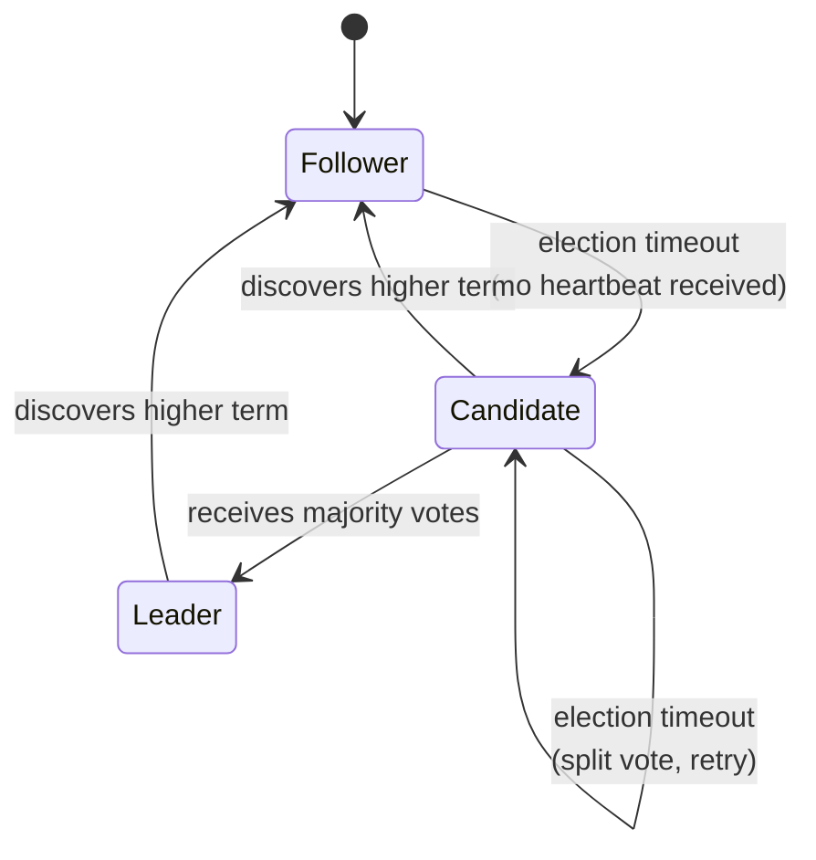
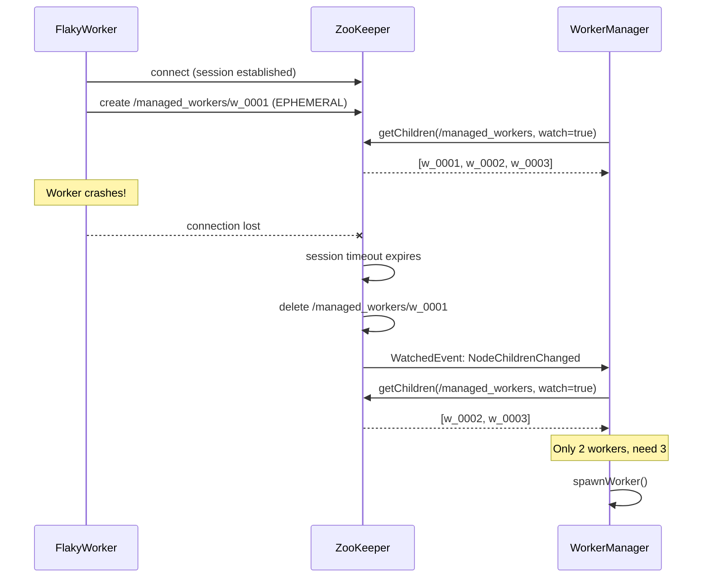

# ZooKeeper for Application Health Management

## 1. Why ZooKeeper?

Distributed systems face a deceptively hard problem: **how does one process know whether another process is still alive?**

At first glance this seems simple — just ping it. But in practice, network-based health checks (keep-alives, heartbeats, HTTP health endpoints) are fragile:

- **False positives**: A process might respond to a ping while being deadlocked, stuck in a GC pause, or functionally broken.
- **False negatives**: A healthy process might miss a heartbeat deadline due to a momentary network partition, causing the monitor to wrongly declare it dead.
- **Who watches the watcher?** If the monitoring process itself crashes, there is no one left to notice that workers are dying. You end up building a monitoring system for your monitoring system.
- **Consensus is hard**: When multiple monitors disagree about whether a process is alive, you need a protocol to resolve the conflict — and getting that right is notoriously difficult (see: the Paxos and Raft papers).

ZooKeeper solves all of this. It is a **distributed coordination service** — a small cluster of servers (typically 3 or 5) that collectively maintain a consistent, ordered, hierarchical data store. Because ZooKeeper itself is replicated and fault-tolerant, it can serve as the single source of truth for "who is alive right now."

Rather than building bespoke health-checking into every application, you connect to ZooKeeper once and let it handle the hard parts: failure detection, notification delivery, and consistency guarantees.

## 2. Leader Election in Distributed Systems

### The Fundamental Problem: Who Is in Charge?

In any distributed system where multiple nodes work together, a core question arises: **who coordinates the work?** A master (or leader) node must be elected to distribute workload to the other nodes, make global decisions, and serve as the serialization point for ordering events. Without a single agreed-upon leader, the system faces several dangers:

- **Split-brain**: Two or more nodes believe they are the leader simultaneously, issuing conflicting commands and corrupting shared state. In a replicated database, two nodes accepting writes as "primary" leads to divergent data that is expensive or impossible to reconcile.
- **Duplicate work**: Without a coordinator to assign tasks, workers may redundantly process the same jobs, wasting compute resources.
- **No ordering guarantees**: Operations that require a total order (log replication, transaction commits, configuration changes) need a single decision-maker to serialize them.
- **Deadlock and livelock**: Peer-to-peer consensus without a leader is expensive — requiring quorum protocols for every single decision — and can stall under contention.

Leader election is therefore a **foundational primitive** in distributed systems. Once a leader is elected, it can distribute work to other nodes, aggregate results, rebalance partitions, and make global decisions that would otherwise require expensive all-to-all coordination.

### Classic Leader Election Algorithms

#### Bully Algorithm (Garcia-Molina, 1982)

Each process has a unique numeric ID. When a process detects the leader has failed, it initiates an election by sending an "Election" message to all processes with higher IDs. If no higher-ID process responds within a timeout, the initiator declares itself leader by broadcasting a "Coordinator" message. If a higher-ID process responds, it "bullies" the initiator and takes over the election. The highest-ID surviving process always wins.

```
Node 3 detects leader failure
  → sends Election to Node 4, Node 5
  → Node 5 responds "OK" (I'll take over)
  → Node 5 sends Election to no one (no higher IDs)
  → Node 5 broadcasts "Coordinator: I am the leader"
```

| Aspect | Detail |
|--------|--------|
| **Best case messages** | O(1) — the highest-ID process initiates and sends one Coordinator message |
| **Worst case messages** | O(n²) — the lowest-ID process triggers a cascade |
| **Assumptions** | Synchronous network, reliable failure detection, crash-stop failures only |
| **Weakness** | Not partition-tolerant; favors highest ID regardless of suitability |

#### Ring Algorithm (Chang-Roberts, 1979)

Processes are arranged in a logical ring. When a process detects the leader has failed, it creates an Election message containing its own ID and sends it clockwise. Each recipient compares the candidate ID with its own: if the incoming ID is higher, it forwards the message; if its own ID is higher, it substitutes its ID and forwards. When the message completes the ring and returns to the originator, that process is the leader.

```
Ring: [N1] → [N2] → [N3] → [N4] → [N1]

N2 detects leader failure, sends Election(2)
N3 receives Election(2), has higher ID → sends Election(3)
N4 receives Election(3), has higher ID → sends Election(4)
N1 receives Election(4), has lower ID → forwards Election(4)
N2 receives Election(4), has lower ID → forwards Election(4)
...
N4 receives its own Election(4) → N4 is the leader
N4 sends Coordinator(4) around the ring
```

| Aspect | Detail |
|--------|--------|
| **Best case messages** | 2(n-1) |
| **Worst case messages** | O(n²) — IDs arranged in decreasing order around ring |
| **Assumptions** | Ring topology, synchronous network, crash-stop failures |
| **Weakness** | Latency proportional to ring size |

#### Paxos-Based Election (Lamport, 1998)

Paxos is a family of consensus protocols that can elect a leader in an asynchronous network. A proposer sends a Prepare request with a unique proposal number to all acceptors. If a majority (quorum) of acceptors respond with promises not to accept lower-numbered proposals, the proposer sends an Accept request. If a quorum accepts, the proposer becomes leader.

| Aspect | Detail |
|--------|--------|
| **Messages per round** | O(n) to/from the quorum |
| **Fault tolerance** | Tolerates f crash failures with 2f+1 nodes |
| **Safety** | Guaranteed under full asynchrony — no timing assumptions |
| **Weakness** | Notoriously complex to implement; "dueling proposers" can prevent progress |

#### Raft Leader Election (Ongaro & Ousterhout, 2014)

Raft was designed explicitly for understandability. Time is divided into **terms** (monotonically increasing logical clocks). All nodes start as followers. If a follower receives no heartbeat from a leader within a randomized election timeout, it becomes a candidate, increments its term, votes for itself, and sends RequestVote RPCs to all other nodes. A candidate receiving votes from a majority becomes leader and immediately begins sending heartbeat AppendEntries RPCs to assert authority.



| Aspect | Detail |
|--------|--------|
| **Messages per election** | O(n) — one RequestVote to each peer |
| **Fault tolerance** | Tolerates f crash failures with 2f+1 nodes |
| **Split vote resolution** | Randomized election timeouts break symmetry |
| **Fencing mechanism** | The term number is a natural fencing token — stale leaders are rejected |
| **Strength** | Understandable, practical, widely adopted |

### Comparison of Classic Algorithms

| Algorithm | Model | Fault Tolerance | Worst Case Messages | Key Strength | Key Weakness |
|-----------|-------|----------------|---------------------|--------------|--------------|
| Bully | Synchronous | Crash-stop | O(n²) | Simple | Not partition-safe |
| Chang-Roberts Ring | Synchronous | Crash-stop | O(n²) | Lower avg messages | Requires ring topology |
| Paxos | Async (safety) | Crash (2f+1) | O(n) per round | Proven correct | Complex implementation |
| Raft | Async safety, partial sync liveness | Crash (2f+1) | O(n) per election | Understandable | Brief availability gap during elections |

### Modern Production Implementations

Modern distributed systems use leader election as a core building block. Each delegates the hard parts to a well-tested consensus protocol:

| System | Protocol | Election Primitive | Fencing Mechanism |
|--------|----------|-------------------|-------------------|
| **Apache ZooKeeper** | ZAB (ZooKeeper Atomic Broadcast) | Ephemeral sequential znodes — smallest sequence wins | zxid / znode version |
| **etcd** | Raft | Raft term-based election among peers | Raft term number |
| **HashiCorp Consul** | Raft | Raft election among server nodes (3 or 5) | Raft term number |
| **Kubernetes** | Lease API (backed by etcd) | Lease object with holderIdentity and duration | Lease resourceVersion |

**ZooKeeper (ZAB)** uses a two-phase protocol: a leader is elected via a quorum vote, then the leader broadcasts state changes to followers in strict order. Applications build on top of this using the ephemeral sequential znode recipe described in this project.

**etcd** is the backbone of Kubernetes — every cluster stores all its state (pods, services, configurations) in etcd. The etcd Raft leader serializes all writes. A 5-node etcd cluster tolerates 2 node failures.

**Consul** deploys agents on every node with a separate set of 3–5 servers participating in Raft consensus. The elected leader processes all queries and replicates state for service discovery, health checking, and KV operations.

**Kubernetes** provides a higher-level Lease API. A process acquires a Lease by writing its identity to a Lease object. The Lease has a duration and must be periodically renewed. If the leader fails to renew, Kubernetes' optimistic concurrency control ensures only one standby can acquire the Lease next.

### Key Challenges

#### Network Partitions and Split-Brain

A network partition isolates subsets of nodes into independent groups. Each group may attempt to elect its own leader — the dreaded **split-brain** scenario. Quorum-based algorithms (Raft, Paxos, ZAB) prevent this: only the partition containing a **majority** of nodes can elect a leader. The minority partition becomes unavailable for writes.

```
Cluster: [N1, N2, N3, N4, N5]
Partition: [N1, N2, N3] | [N4, N5]

Left partition (3 nodes): has quorum → can elect a leader
Right partition (2 nodes): no quorum → read-only or unavailable
```

Additional defenses include:
- **Fencing (STONITH — "Shoot The Other Node In The Head")**: forcefully power off a node suspected of being a stale leader before allowing a new leader to operate.
- **Fencing tokens**: every lease acquisition increments a monotonic token; storage servers reject requests bearing old tokens (see Martin Kleppmann's analysis of distributed locking).
- **Leader leases with bounded duration**: authority expires after a fixed time unless renewed, preventing indefinite stale leadership.

#### CAP Theorem Implications

The CAP theorem (Brewer, 2000; proved by Gilbert & Lynch, 2002) states that during a network partition, a system must choose between **Consistency** and **Availability**:

- **CP systems** (ZooKeeper, etcd, Consul): prioritize consistency. During a partition, the minority side becomes unavailable. No quorum means no leader means no writes.
- **AP systems** (Cassandra, DynamoDB): prioritize availability. May allow conflicting writes during partitions, resolving conflicts later. These systems typically do not use single-leader election.

Leader election is inherently a **CP** operation — you cannot guarantee a single leader while remaining fully available during partitions.

#### Byzantine Failures

The algorithms above assume **crash-stop** failures — nodes either work correctly or halt entirely. **Byzantine** failures, where nodes send arbitrary or malicious messages, require specialized protocols like PBFT (Practical Byzantine Fault Tolerance, Castro & Liskov, 1999), which needs **3f+1 nodes** to tolerate f failures (vs. 2f+1 for crash failures). Most production systems (ZooKeeper, etcd, Consul) do not handle Byzantine failures, assuming a trusted internal network.

### Best Practices for Leader Election

1. **Use lease-based leadership, not indefinite locks.** A leader holds a lease for a fixed duration and must periodically renew it. If the leader crashes, the lease expires, and a new leader can be elected. This avoids permanent lockout. ZooKeeper ephemeral nodes with session timeouts and Kubernetes Leases both implement this pattern.

2. **Use fencing tokens for correctness.** Every lease acquisition should produce a **monotonically increasing fencing token**. All downstream resources (databases, storage) must reject requests bearing a token older than the last seen token. This is the only truly safe way to prevent a stale leader (one that hasn't yet realized it lost leadership) from corrupting data. In ZooKeeper, the zxid or znode version number serves this purpose. In Raft, the term number is a natural fencing token.

3. **Heartbeats must be frequent relative to election timeouts.** Raft recommends: `heartbeat interval ≪ election timeout ≪ MTBF (mean time between failures)`. Too-frequent elections waste resources; too-infrequent elections leave the system leaderless for too long.

4. **Support graceful leadership transfer.** Rather than waiting for a timeout when shutting down a leader for maintenance, the leader can explicitly hand off to a follower. In Raft, the leader sends a TimeoutNow RPC to a chosen follower, causing it to immediately start an election. This avoids the availability gap of waiting for election timeouts.

5. **Minimize leader responsibilities.** Design the system so that brief dual-leadership during failover causes at worst duplicate work, not data corruption. If you cannot support fencing tokens end-to-end, accept that two leaders may occasionally overlap and ensure the system handles this gracefully.

### Failure Detection: A Prerequisite for Election

Before a new leader can be elected, the system must detect that the current leader has failed. This is surprisingly difficult in an asynchronous network.

| Mechanism | How It Works | Used By |
|-----------|-------------|---------|
| **Heartbeat + timeout** | Leader sends periodic heartbeats; followers trigger election if no heartbeat within timeout. Simple but tuning the timeout is a fundamental tension — too short causes false positives, too long delays detection. | Raft, ZAB, most production systems |
| **Phi accrual failure detector** | Outputs a continuous suspicion level (φ) based on statistical distribution of heartbeat inter-arrival times. Adapts dynamically to network conditions. | Akka, Apache Cassandra |
| **SWIM protocol** | Each node periodically pings a random peer; on failure, asks k others to probe indirectly. Membership changes propagated via gossip in O(log n) time with only O(n) messages per detection period. | HashiCorp Serf, Consul (gossip layer) |

The FLP impossibility result (Fischer, Lynch, Paterson, 1985) proves that no deterministic algorithm can guarantee consensus in a fully asynchronous system where even one process may fail. All practical failure detectors therefore make timing assumptions — they trade theoretical impossibility for practical reliability.

### How This Project Implements Leader Election

This project uses ZooKeeper's **ephemeral sequential znode** recipe, sometimes called the "small-node-wins" algorithm:

1. Each node creates an ephemeral sequential znode under `/election` (e.g., `/election/c_0000000000`).
2. The node with the smallest sequence number becomes the leader.
3. Each non-leader watches its **immediate predecessor** (not the leader), forming a chain that limits notifications to O(1) per failure — avoiding the thundering herd problem.
4. When a predecessor's ephemeral znode is deleted (the node crashed or disconnected), the watcher fires and the next node re-evaluates whether it is now the leader.
5. The `OnElectionCallback` interface decouples election from behavior — the same binary acts as leader or worker depending on election outcome.

This approach leverages ZooKeeper's built-in session management and ephemeral node lifecycle, giving the application leader election with automatic failover and no custom heartbeat code — the coordination service handles the hard parts.

---

## 3. How ZooKeeper Replaces Keep-Alives

Traditional keep-alive systems work like this:

```
Worker → periodic heartbeat → Monitor
         "I'm still alive"
```

The monitor sets a deadline. If the heartbeat doesn't arrive in time, it assumes the worker is dead. This approach has two fundamental weaknesses:

1. **Tuning the timeout is a losing game.** Too short and you get false alarms from GC pauses or network blips. Too long and dead workers go unnoticed for minutes.
2. **The monitor must poll or maintain timers for every worker.** This scales poorly and is itself a single point of failure.

ZooKeeper replaces this entire mechanism with **ephemeral nodes** and **sessions**.

### Sessions

When an application connects to ZooKeeper, it establishes a **session**. ZooKeeper and the client maintain this session with automatic, built-in heartbeats — you don't write any keep-alive code. If the client crashes, hangs, or loses network connectivity for longer than the session timeout (e.g. 3 seconds), ZooKeeper declares the session dead.

### Ephemeral Nodes

An **ephemeral node** (znode) is a piece of data in ZooKeeper's tree that is **tied to the session that created it**. When the session dies, ZooKeeper automatically deletes the ephemeral node. No application code runs. No heartbeat handler fires. The ZooKeeper cluster itself handles the cleanup.

This means the presence of an ephemeral node is a reliable proxy for "the application that created it is alive." Its absence means the application is gone.

```
Traditional:       Worker --heartbeat--> Monitor --timeout--> "worker is dead"
                   (app code)            (app code)           (app code)

ZooKeeper:         Worker creates        Worker crashes       ZooKeeper deletes
                   ephemeral node        (or disconnects)     the node automatically
                   (one line of code)    (no code needed)     (no code needed)
```

The application does not need to implement any heartbeat loop. It creates one ephemeral node at startup, and ZooKeeper does the rest.

## 4. What a Watcher Is

Knowing that an ephemeral node disappears when its creator dies is only half the story. The other half is: **how does anyone find out?**

This is where **Watchers** come in. A Watcher is a one-time callback that ZooKeeper triggers when something changes on a node you're interested in. You register a watcher by passing it to a read operation:

```java
// "this" is the Watcher — ZooKeeper will call this.process() when
// the children of WORKERS_PATH change (a child added or removed)
List<String> children = zooKeeper.getChildren(WORKERS_PATH, this);
```

When a change occurs — a child node is created, deleted, or modified — ZooKeeper delivers a `WatchedEvent` to the watcher's `process()` method:

```java
@Override
public void process(WatchedEvent event) {
    switch (event.getType()) {
        case NodeChildrenChanged:
            // A worker was added or removed — react accordingly
            reconcileWorkers();
            break;
    }
}
```

### Key properties of watchers

| Property | What it means |
|----------|---------------|
| **One-time** | A watcher fires exactly once. You must re-register it in the callback to keep getting notifications. This is by design — it prevents event storms. |
| **Ordered** | Events are delivered in the order they happened. You will never see a "node deleted" event before the "node created" event. |
| **No missed events** | If a node changes between the time you set the watcher and receive the response, you still get the event. |
| **Push, not poll** | You don't loop checking for changes. ZooKeeper pushes the event to you. |

Because watchers are one-time, a common pattern is to re-register the watcher inside the callback itself. In our project, `getChildren(WORKERS_PATH, this)` both reads the current children **and** sets a new watcher for the next change — creating a self-sustaining notification loop with no polling.

### ZooKeeper API Methods That Accept a Watcher

The `ZooKeeper` class provides several methods that accept a `Watcher` parameter. Each read operation sets a one-time watcher that fires when the watched znode changes in a specific way:

#### Read operations that set a watcher

| Method | What it watches | Events that trigger the watcher |
|--------|----------------|--------------------------------|
| **`exists(path, watcher)`** | A specific znode's lifecycle and data | `NodeCreated`, `NodeDeleted`, `NodeDataChanged` |
| **`getData(path, watcher)`** | A specific znode's data | `NodeDataChanged`, `NodeDeleted` |
| **`getChildren(path, watcher)`** | The children of a znode | `NodeChildrenChanged` |
| **`getConfig(watcher, stat)`** | The ZooKeeper cluster configuration | `NodeDataChanged` |

Each of these also has **async overloads** that take an `AsyncCallback` in addition to the `Watcher`, allowing non-blocking usage:

```java
// Synchronous — blocks until the result is available
List<String> children = zooKeeper.getChildren(path, watcher);

// Asynchronous — returns immediately, result delivered to callback
zooKeeper.getChildren(path, watcher, childrenCallback, contextObject);
```

#### Watcher management methods

| Method | Purpose |
|--------|---------|
| **`register(watcher)`** | Replaces the default session watcher (the one originally passed to the `ZooKeeper` constructor) |
| **`addWatch(path, watcher, mode)`** | Sets a **persistent** or **persistent-recursive** watcher (ZooKeeper 3.6+) that does not need re-registering after each event — a significant improvement over one-time watchers for long-lived monitoring |
| **`removeWatches(path, watcher, type, local)`** | Explicitly removes a previously set watcher |

#### `addWatch` modes (ZooKeeper 3.6+)

The `addWatch` method introduced persistent watchers that survive across multiple events:

| Mode | Behavior |
|------|----------|
| `PERSISTENT` | Watches a single znode for all event types. Fires on every change and **does not need to be re-registered**. |
| `PERSISTENT_RECURSIVE` | Watches a znode and **all its descendants** recursively. Fires on creation, deletion, or data change of any znode in the subtree. |

This is a major improvement over the classic one-time watchers — persistent watchers eliminate the re-registration pattern and the brief window between event delivery and watcher re-registration where events could theoretically be missed.

#### How this project uses watcher methods

This project uses two of the read operations to set watchers:

- **`exists(path, this)`** — in `LeaderElection`, to watch the predecessor znode for deletion (triggering re-election)
- **`getChildren(path, this)`** — in `ServiceRegistry` and `Autohealer`, to watch for membership changes (workers joining or leaving)

Both follow the one-time re-registration pattern: the watcher callback re-invokes the same method to set a fresh watcher for the next event.

## 5. Embedding ZooKeeper in Any Application

Any application — regardless of language, framework, or purpose — can become "ZooKeeper-managed" by doing two things at startup:

1. **Connect** to ZooKeeper (establishing a session)
2. **Create an ephemeral node** (registering its presence)

That's it. There is nothing else the application needs to do for health management. No heartbeat thread, no health endpoint, no keep-alive timer.

Here is the entire integration from this project's `FlakyWorker`:

```java
// Step 1: Connect
this.zooKeeper = new ZooKeeper("localhost:2181", 3000, this);

// Step 2: Create an ephemeral node
zooKeeper.create(
    "/managed_workers/w_",             // path prefix
    workerId.getBytes(),               // optional metadata (worker ID, address, etc.)
    ZooDefs.Ids.OPEN_ACL_UNSAFE,       // ACL
    CreateMode.EPHEMERAL_SEQUENTIAL);  // ephemeral + auto-incrementing suffix
```

From this point forward:

- **If the application crashes** — the JVM exits, the TCP connection drops, ZooKeeper's session timer expires, and the ephemeral node is deleted. Any watcher on the parent node is notified.
- **If the application hangs** — the ZooKeeper client library can no longer send session heartbeats. After the session timeout, the same cleanup happens.
- **If the network partitions** — same outcome. The session expires, the node is deleted, watchers fire.

The application doesn't need to know about any of this. It just creates one node and goes about its business.

### What the monitoring side looks like

A separate process (the `WorkerManager` in our project) watches the parent node:

```java
// Read current children AND set a watcher for changes
List<String> children = zooKeeper.getChildren("/managed_workers", this);

if (children.size() < targetWorkerCount) {
    spawnWorker();  // launch a replacement
}
```

When any child ephemeral node disappears (a worker died), ZooKeeper fires the `NodeChildrenChanged` event, and the manager reacts — in our case, by spawning a replacement process.



This pattern works for any type of application — web servers, batch jobs, microservices, database proxies — because the ZooKeeper integration is completely decoupled from the application's actual work. The worker doesn't know or care that it's being watched.

## 6. Running the Demo

### Prerequisites

- Docker and Docker Compose
- Java 21
- Maven 3.9+

### Start ZooKeeper

```bash
docker compose up -d zookeeper
```

Verify it's healthy:

```bash
docker exec zookeeper bash -c 'echo ruok | nc localhost 2181'
```

You should see `imok`.

### Option A: Run locally (outside Docker)

Build the project from the root:

```bash
mvn clean package -DskipTests
```

Start the manager, which will spawn 3 worker processes automatically:

```bash
java -jar example/target/example-1.0-SNAPSHOT-jar-with-dependencies.jar 3 localhost:2181
```

You'll see output like:

```
[manager] Starting — target workers: 3, ZooKeeper: localhost:2181
[manager] Connected to ZooKeeper at localhost:2181
[manager] Created /managed_workers
[manager] Current workers: 0, target: 3
[manager] Spawning new worker process...
[manager] Spawning new worker process...
[manager] Spawning new worker process...
[manager] Pool OK — 3 workers running
[worker-12345] Registered at /managed_workers/w_0000000000
[worker-12345] Working... iteration 1
[worker-12346] Registered at /managed_workers/w_0000000001
[worker-12347] Registered at /managed_workers/w_0000000002
```

After ~10 iterations (roughly 10 seconds), a worker will randomly crash:

```
[worker-12345] CRASH at iteration 8!
[manager] Detected worker pool change!
[manager] Current workers: 2, target: 3
[manager] Spawning new worker process...
[manager] Pool OK — 3 workers running
```

The manager detects the death via ZooKeeper's watcher and immediately spawns a replacement. The pool is maintained at 3 indefinitely.

### Option B: Run in Docker

Build and start both ZooKeeper and the manager container:

```bash
docker compose up -d worker-manager
```

This builds the example module in a multi-stage Docker build and starts the manager, which spawns workers as child JVM processes inside the container. View the logs:

```bash
docker compose logs -f worker-manager
```

### Inspecting ZooKeeper state

While the demo is running, you can inspect the live znodes using ZooKeeper's CLI:

```bash
docker exec -it zookeeper bin/zkCli.sh
```

Then inside the CLI:

```
ls /managed_workers
# [w_0000000000, w_0000000001, w_0000000002]

get /managed_workers/w_0000000000
# worker-12345
```

Watch as workers crash and get replaced — the node names will increment as new ephemeral-sequential nodes are created, and old ones disappear.

### Cleanup

```bash
docker compose down
```

---

## Appendix A: Hands-On ZooKeeper CLI Reference

This appendix is a practical guide to working with ZooKeeper directly from the command line using `zkCli.sh`. Every command is covered with its full syntax, flags, and worked examples you can run against a live ZooKeeper instance.

### A.1 Connecting to ZooKeeper

#### Local ZooKeeper instance

```bash
bin/zkCli.sh -server 127.0.0.1:2181
```

#### ZooKeeper running in Docker

```bash
docker exec -it zookeeper bin/zkCli.sh
```

#### Connecting to a remote server

```bash
bin/zkCli.sh -server 192.168.1.100:2181
```

On a successful connection you'll see output like:

```
Connecting to 127.0.0.1:2181
...
Welcome to ZooKeeper!
JLine support is enabled
[zk: 127.0.0.1:2181(CONNECTED) 0]
```

The prompt shows the server address, connection state (`CONNECTED`), and a command counter.

#### Connection and session management commands

| Command | Syntax | Description |
|---------|--------|-------------|
| `connect` | `connect host:port` | Connect to a different ZooKeeper server without restarting the CLI |
| `close` | `close` | Close the current session (ephemeral nodes created in this session are deleted) |
| `quit` | `quit` | Exit the CLI entirely |

```bash
# Switch to a different server mid-session
[zk: localhost:2181(CONNECTED) 0] connect 10.0.0.5:2181

# Close the session but stay in the CLI
[zk: localhost:2181(CONNECTED) 1] close
[zk: localhost:2181(CLOSED) 2]

# Reconnect after closing
[zk: localhost:2181(CLOSED) 2] connect localhost:2181
```

---

### A.2 Command Reference

#### `create` — Create a znode

```
create [-s] [-e] [-c] [-t ttl] path [data] [acl]
```

| Flag | Meaning |
|------|---------|
| `-s` | Sequential — ZooKeeper appends a 10-digit monotonically increasing sequence number |
| `-e` | Ephemeral — znode is deleted when the creating session ends |
| `-c` | Container — automatically deleted when its last child is removed (ZK 3.5+) |
| `-t ttl` | TTL in milliseconds — persistent znode is auto-deleted if not modified within the TTL and has no children (ZK 3.5+, disabled by default) |

Flags can be combined. `-s -e` creates an ephemeral sequential znode (the type used for leader election in this project).

```bash
# Create a persistent znode with data
[zk:] create /myapp "application config"

# Create a persistent znode with no data
[zk:] create /myapp/settings

# Create an ephemeral znode (deleted when this CLI session closes)
[zk:] create -e /myapp/lock "held-by-client-1"

# Create a sequential znode (ZooKeeper appends a sequence number)
[zk:] create -s /myapp/worker_ "worker-data"
# Created /myapp/worker_0000000000

# Create an ephemeral sequential znode (used for leader election)
[zk:] create -s -e /election/c_ ""
# Created /election/c_0000000000

# Create a container znode
[zk:] create -c /myapp/leaders
```

---

#### `ls` — List children of a znode

```
ls [-s] [-w] [-R] path
```

| Flag | Meaning |
|------|---------|
| `-s` | Include the stat (metadata) of the znode |
| `-w` | Set a watcher — you'll be notified when children change |
| `-R` | Recursive — list the entire subtree |

```bash
# List children of root
[zk:] ls /
# [myapp, zookeeper]

# List children with stat metadata
[zk:] ls -s /myapp
# [settings, worker_0000000000]
# cZxid = 0x4
# ...
# numChildren = 2

# List the entire subtree recursively
[zk:] ls -R /myapp
# /myapp
# /myapp/settings
# /myapp/worker_0000000000

# Set a watcher on children changes
[zk:] ls -w /myapp
# [settings, worker_0000000000]
# (you'll see a WatchedEvent when a child is added or removed)
```

---

#### `get` — Read a znode's data

```
get [-s] [-w] path
```

| Flag | Meaning |
|------|---------|
| `-s` | Include the stat (metadata) alongside the data |
| `-w` | Set a watcher — you'll be notified when the data changes or the znode is deleted |

```bash
# Get the data stored in a znode
[zk:] get /myapp
# application config

# Get data with stat metadata
[zk:] get -s /myapp
# application config
# cZxid = 0x4
# ctime = Thu Mar 20 10:00:00 UTC 2026
# mZxid = 0x4
# mtime = Thu Mar 20 10:00:00 UTC 2026
# pZxid = 0x6
# cversion = 2
# dataVersion = 0
# aclVersion = 0
# ephemeralOwner = 0x0
# dataLength = 18
# numChildren = 2

# Set a watcher for data changes
[zk:] get -w /myapp
# (you'll see a WatchedEvent when data is modified or the znode is deleted)
```

The stat fields:

| Field | Meaning |
|-------|---------|
| `cZxid` | Transaction ID that created this znode |
| `mZxid` | Transaction ID of the last modification |
| `pZxid` | Transaction ID of the last child modification |
| `ctime` / `mtime` | Creation / last modification timestamps |
| `cversion` | Number of changes to this znode's children |
| `dataVersion` | Number of changes to this znode's data |
| `aclVersion` | Number of changes to this znode's ACL |
| `ephemeralOwner` | Session ID of the owner if ephemeral (`0x0` if persistent) |
| `dataLength` | Length of the data in bytes |
| `numChildren` | Number of direct children |

---

#### `set` — Update a znode's data

```
set [-s] [-v version] path data
```

| Flag | Meaning |
|------|---------|
| `-s` | Print the stat after updating |
| `-v version` | Only update if the current `dataVersion` matches — optimistic concurrency control |

```bash
# Update the data
[zk:] set /myapp "updated config"

# Conditional update (only succeeds if dataVersion is 0)
[zk:] set -v 0 /myapp "new config"

# If the version doesn't match, the command fails:
[zk:] set -v 0 /myapp "another update"
# version No is not valid : /myapp
```

The `-v` flag is how ZooKeeper implements compare-and-swap (CAS) operations. It prevents lost updates when multiple clients modify the same znode concurrently.

---

#### `stat` — Show znode metadata without data

```
stat [-w] path
```

| Flag | Meaning |
|------|---------|
| `-w` | Set a watcher for changes |

```bash
[zk:] stat /myapp
# cZxid = 0x4
# ctime = Thu Mar 20 10:00:00 UTC 2026
# ...
# numChildren = 2
```

Like `get -s` but omits the data payload — useful for large znodes when you only need metadata.

---

#### `delete` — Delete a single znode

```
delete [-v version] path
```

| Flag | Meaning |
|------|---------|
| `-v version` | Only delete if the current `dataVersion` matches |

The znode must have **no children** — `delete` does not recurse.

```bash
# Delete a leaf znode
[zk:] delete /myapp/settings

# Conditional delete
[zk:] delete -v 0 /myapp/settings

# This fails if the znode has children:
[zk:] delete /myapp
# Node not empty: /myapp
```

---

#### `deleteall` — Recursively delete a znode and all its descendants

```
deleteall path [-b batch_size]
```

This replaces the older `rmr` command (which is deprecated). It deletes the znode at `path` and every znode beneath it.

```bash
# Delete /myapp and everything under it
[zk:] deleteall /myapp

# Verify it's gone
[zk:] ls /
# [zookeeper]
```

**Warning:** There is no confirmation prompt. This is the ZooKeeper equivalent of `rm -rf`.

---

#### `sync` — Force synchronization with the leader

```
sync path
```

Forces the connected ZooKeeper server to sync its state with the leader before serving subsequent reads. Useful when you need a fully up-to-date read after a write that may have been handled by a different server.

```bash
[zk:] sync /myapp
# Sync returned 0
```

---

#### `getAcl` — View access control list

```
getAcl [-s] path
```

| Flag | Meaning |
|------|---------|
| `-s` | Include stat metadata |

```bash
[zk:] getAcl /myapp
# 'world,'anyone
# : cdrwa
```

The permissions are: **c**reate, **d**elete, **r**ead, **w**rite, **a**dmin.

---

#### `setAcl` — Set access control list

```
setAcl [-s] [-v version] [-R] path acl
```

| Flag | Meaning |
|------|---------|
| `-s` | Print stat after updating |
| `-v version` | Only update if the current `aclVersion` matches |
| `-R` | Apply recursively to all descendants |

ACL format: `scheme:id:permissions`

```bash
# Restrict to authenticated users only (read + write)
[zk:] setAcl /myapp auth:user1:rw

# Open access (default)
[zk:] setAcl /myapp world:anyone:cdrwa

# Apply ACL recursively
[zk:] setAcl -R /myapp world:anyone:cdrwa
```

---

#### `addauth` — Add authentication credentials

```
addauth scheme auth
```

Authenticates the current session. Required before accessing znodes with non-open ACLs.

```bash
# Authenticate with digest scheme
[zk:] addauth digest user1:password123
```

---

#### `whoami` — Show current authentication

```
whoami
```

```bash
[zk:] whoami
# Auth scheme: User
# ip: 127.0.0.1
# digest: user1
```

---

#### `setquota` — Set limits on a znode

```
setquota -n|-b|-N|-B val path
```

| Flag | Meaning |
|------|---------|
| `-n` | Soft limit on the number of znodes (count) |
| `-b` | Soft limit on total data size in bytes |
| `-N` | Hard limit on the number of znodes |
| `-B` | Hard limit on total data size in bytes |

Soft limits log warnings; hard limits reject operations that would exceed the quota.

```bash
# Allow at most 100 znodes under /myapp (soft limit)
[zk:] setquota -n 100 /myapp

# Hard limit of 1MB total data
[zk:] setquota -B 1048576 /myapp
```

---

#### `listquota` — Show quota settings and usage

```
listquota path
```

```bash
[zk:] listquota /myapp
# absolute path is /zookeeper/quota/myapp/zookeeper_limits
# Output quota for /myapp count=100,bytes=-1
# Output stat for /myapp count=3,bytes=42
```

---

#### `delquota` — Remove quota

```
delquota [-n|-b|-N|-B] path
```

```bash
# Remove the count quota
[zk:] delquota -n /myapp

# Remove all quotas
[zk:] delquota /myapp
```

---

#### `getAllChildrenNumber` — Count all descendants

```
getAllChildrenNumber path
```

Returns the total number of znodes in the entire subtree (not just direct children).

```bash
[zk:] getAllChildrenNumber /
# 12
```

---

#### `getEphemerals` — List ephemeral znodes in this session

```
getEphemerals [path]
```

Shows all ephemeral znodes created by the current session, optionally filtered by prefix.

```bash
# All ephemerals in this session
[zk:] getEphemerals
# [/election/c_0000000000, /myapp/lock]

# Only ephemerals under /election
[zk:] getEphemerals /election
# [/election/c_0000000000]
```

---

#### `config` — View cluster configuration

```
config [-c] [-w] [-s]
```

| Flag | Meaning |
|------|---------|
| `-c` | Show the config from the config znode directly |
| `-w` | Set a watcher for configuration changes |
| `-s` | Include stat metadata |

```bash
[zk:] config
# server.1=zoo1:2888:3888:participant;0.0.0.0:2181
# server.2=zoo2:2888:3888:participant;0.0.0.0:2181
# server.3=zoo3:2888:3888:participant;0.0.0.0:2181
```

---

#### `reconfig` — Reconfigure the cluster at runtime

```
reconfig [-s] [-v version] [[-file path] | [-members ...] | [-add ...] [-remove ...]]
```

Dynamically adds or removes servers from the ZooKeeper ensemble without downtime. Requires ZooKeeper 3.5+ with dynamic reconfiguration enabled.

```bash
# Add a new server
[zk:] reconfig -add server.4=zoo4:2888:3888:participant;2181

# Remove a server by ID
[zk:] reconfig -remove 4
```

---

#### `removewatches` — Remove watchers from a znode

```
removewatches path [-c|-d|-a] [-l]
```

| Flag | Meaning |
|------|---------|
| `-c` | Remove child watchers |
| `-d` | Remove data watchers |
| `-a` | Remove all watchers |
| `-l` | Local removal only (don't notify the server) |

```bash
[zk:] removewatches /myapp -a
```

---

#### `printwatches` — Toggle watcher event display

```
printwatches on|off
```

Controls whether `WatchedEvent` notifications are printed to the console. Enabled by default.

```bash
[zk:] printwatches off
# (watcher events are now silent)

[zk:] printwatches on
# (watcher events are printed again)
```

---

#### `history` — Show command history

```
history
```

Displays the last 11 commands with their index numbers.

```bash
[zk:] history
# 0 - ls /
# 1 - create /myapp "test"
# 2 - get /myapp
# 3 - history
```

---

#### `redo` — Re-execute a previous command

```
redo cmdno
```

Re-runs a command by its index from `history`.

```bash
[zk:] redo 2
# (re-runs "get /myapp")
```

---

#### `version` — Show ZooKeeper version

```
version
```

```bash
[zk:] version
# ZooKeeper CLI version: 3.9.2- ...
```

---

#### `help` — List all commands

```
help
```

Prints a summary of all available commands and their syntax.

---

### A.3 Hands-On Exercises

These exercises let you explore the key ZooKeeper concepts used in this project. Start ZooKeeper and connect with `zkCli.sh` before beginning.

#### Exercise 1: Create and inspect znodes

```bash
# Create a namespace for an application
[zk:] create /myapp "my application"

# Create child znodes
[zk:] create /myapp/config "timeout=3000"
[zk:] create /myapp/status "running"

# List the tree
[zk:] ls -R /myapp
# /myapp
# /myapp/config
# /myapp/status

# Read data and metadata
[zk:] get -s /myapp/config
# timeout=3000
# cZxid = ...
# dataVersion = 0

# Update data and observe the version increment
[zk:] set /myapp/config "timeout=5000"
[zk:] get -s /myapp/config
# timeout=5000
# dataVersion = 1

# Clean up
[zk:] deleteall /myapp
```

#### Exercise 2: Ephemeral nodes and session lifecycle

```bash
# Create a persistent parent (required — ephemeral nodes can't have children)
[zk:] create /workers

# Create an ephemeral node (simulates a worker registering)
[zk:] create -e /workers/worker-1 "192.168.1.10:8080"

# Verify it exists
[zk:] ls /workers
# [worker-1]

# Check the ephemeralOwner — it will be non-zero (your session ID)
[zk:] get -s /workers/worker-1
# ephemeralOwner = 0x1000a... (your session ID)

# Now close the session
[zk:] close

# Reconnect and check — the ephemeral node is gone
[zk:] connect localhost:2181
[zk:] ls /workers
# []

# Clean up
[zk:] delete /workers
```

This is exactly how the autohealer in this project detects worker failures — ephemeral nodes vanish when the worker process disconnects.

#### Exercise 3: Simulate leader election

```bash
# Create the election namespace
[zk:] create /election

# Simulate three nodes volunteering for leadership
[zk:] create -s -e /election/c_ "node-A"
# Created /election/c_0000000000
[zk:] create -s -e /election/c_ "node-B"
# Created /election/c_0000000001
[zk:] create -s -e /election/c_ "node-C"
# Created /election/c_0000000002

# List candidates — the smallest sequence number is the leader
[zk:] ls /election
# [c_0000000000, c_0000000001, c_0000000002]

# c_0000000000 is the leader. Read its data to see who it is:
[zk:] get /election/c_0000000000
# node-A

# Simulate the leader crashing by deleting its node
[zk:] delete /election/c_0000000000

# Now c_0000000001 is the smallest — node-B is the new leader
[zk:] ls /election
# [c_0000000001, c_0000000002]
[zk:] get /election/c_0000000001
# node-B

# Clean up
[zk:] deleteall /election
```

#### Exercise 4: Watchers in action

Open **two separate terminals**, each connected to ZooKeeper with `zkCli.sh`.

**Terminal 1** — the watcher:

```bash
# Set a watcher on children of /demo
[zk:] create /demo
[zk:] ls -w /demo
# []
```

**Terminal 2** — trigger the watcher:

```bash
# Create a child — this triggers the watcher in Terminal 1
[zk:] create /demo/child-1 "hello"
```

**Terminal 1** — you'll see:

```
WATCHER::
WatchedEvent state:SyncConnected type:NodeChildrenChanged path:/demo zxid:...
```

Note that the watcher fired **once**. If you create another child in Terminal 2, Terminal 1 will **not** be notified unless you re-register the watcher:

**Terminal 1:**

```bash
# Re-register the watcher
[zk:] ls -w /demo
# [child-1]
```

**Terminal 2:**

```bash
# This triggers the watcher again
[zk:] create /demo/child-2 "world"
```

This demonstrates the one-time watcher behavior — the same pattern used throughout this project, where watcher callbacks re-register themselves to create a continuous notification loop.

```bash
# Clean up (either terminal)
[zk:] deleteall /demo
```

#### Exercise 5: Optimistic concurrency with version checks

```bash
# Create a znode
[zk:] create /counter "0"

# Check its version
[zk:] get -s /counter
# 0
# dataVersion = 0

# Update with version check — succeeds because version matches
[zk:] set -v 0 /counter "1"

# Try updating with the old version — fails
[zk:] set -v 0 /counter "2"
# version No is not valid : /counter

# Use the current version
[zk:] set -v 1 /counter "2"

# Clean up
[zk:] delete /counter
```

This is the ZooKeeper equivalent of a compare-and-swap (CAS) operation — the same mechanism that prevents split-brain in leader election.

### A.4 Quick Reference Card

| Command | Purpose | Example |
|---------|---------|---------|
| `create [-s] [-e] [-c] path [data]` | Create a znode | `create -s -e /election/c_ ""` |
| `ls [-s] [-w] [-R] path` | List children | `ls -R /` |
| `get [-s] [-w] path` | Read data | `get -s /myapp` |
| `set [-v ver] path data` | Update data | `set -v 0 /myapp "new"` |
| `stat [-w] path` | Show metadata | `stat /myapp` |
| `delete [-v ver] path` | Delete one znode | `delete /myapp/child` |
| `deleteall path` | Delete subtree | `deleteall /myapp` |
| `getAcl path` | View permissions | `getAcl /myapp` |
| `setAcl [-R] path acl` | Set permissions | `setAcl /myapp world:anyone:cdrwa` |
| `addauth scheme auth` | Authenticate | `addauth digest user:pass` |
| `whoami` | Show auth info | `whoami` |
| `setquota -n\|-b val path` | Set limits | `setquota -n 100 /myapp` |
| `listquota path` | Show limits | `listquota /myapp` |
| `delquota path` | Remove limits | `delquota /myapp` |
| `getAllChildrenNumber path` | Count descendants | `getAllChildrenNumber /` |
| `getEphemerals [path]` | List session ephemerals | `getEphemerals /election` |
| `sync path` | Sync with leader | `sync /myapp` |
| `config` | View cluster config | `config` |
| `reconfig -add\|-remove ...` | Reconfigure cluster | `reconfig -remove 4` |
| `removewatches path [-a]` | Remove watchers | `removewatches /myapp -a` |
| `printwatches on\|off` | Toggle watcher output | `printwatches off` |
| `connect host:port` | Connect/reconnect | `connect localhost:2181` |
| `close` | Close session | `close` |
| `history` | Show recent commands | `history` |
| `redo cmdno` | Replay a command | `redo 3` |
| `version` | Show version | `version` |
| `help` | List commands | `help` |
| `quit` | Exit CLI | `quit` |
